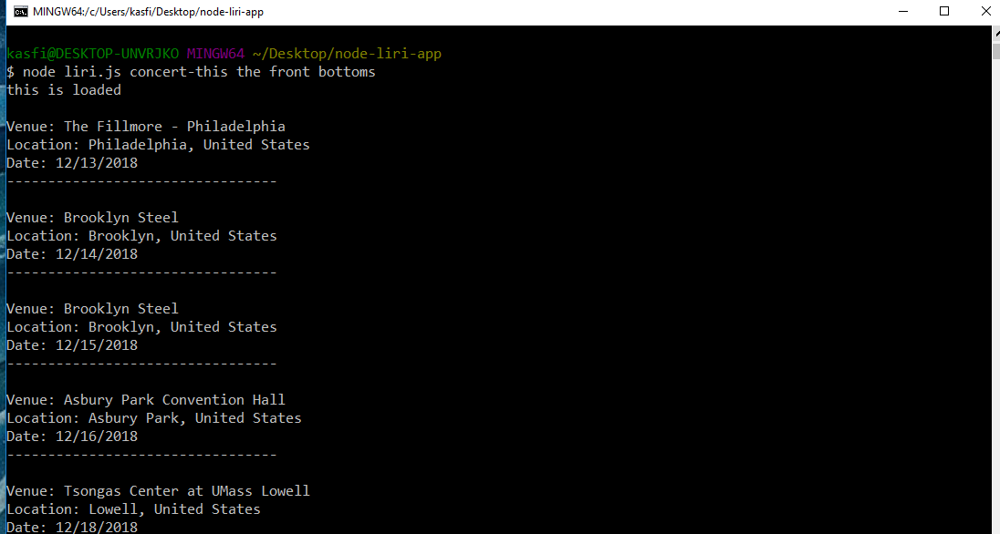
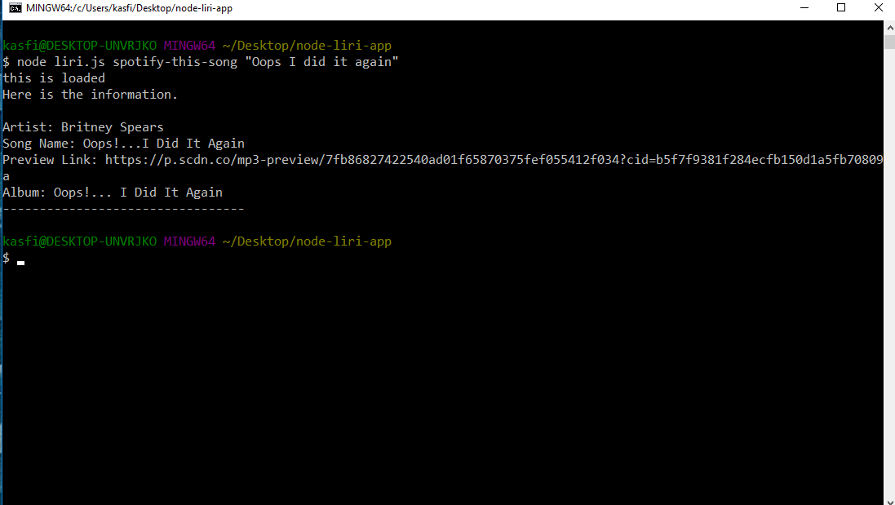
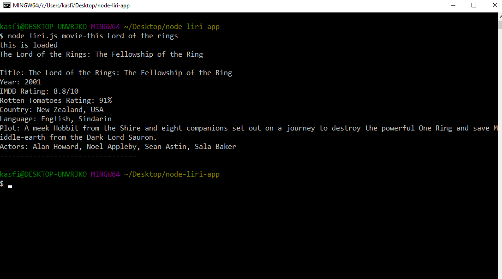

# node-liri-app

What each command should do:

  1. node liri.js concert-this <artist/band name here>
    

  2. node liri.js spotify-this-song '<song name here>'
    
  
  3. node liri.js movie-this '<movie name here>'
    

